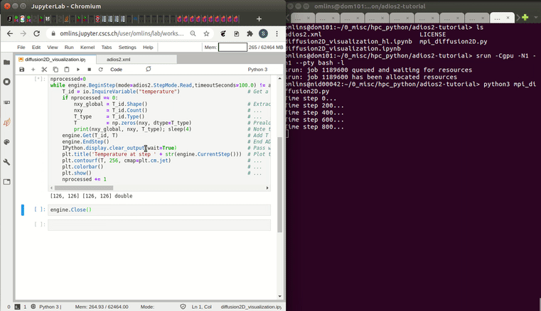

# A concise ADIOS2 tutorial

This is a concise tutorial on the usage of ADIOS2 [1,2] on a supercomputer. It is part of a recorded webinar on parallel I/O given at the Swiss National Supercomputing Centre, CSCS [3]. The ADIOS2 tutorial (speaker: Dr. Samuel Omlin) starts after a 15 min general introduction to parallel I/O on Piz Daint: jump directly to the [ADIOS2 tutorial](https://youtu.be/gl_vIfjvTkc?t=1087) or start the [webinar from the beginning](https://www.youtube.com/watch?v=gl_vIfjvTkc) (the slides are found [here](parallel_io_webinar_with_ADIOS2_tutorial.pdf)). The tutorial takes about 35 min and is followed by a 30 min discussion on visualization related topics, which also relates to ADIOS2 in multiple parts (speaker: Dr. Jean Favre).

The ADIOS2 tutorial covers the following topics:
1. accessing the file system in parallel;
2. selecting different file formats (including HDF5);
3. including on-the-fly lossy or lossless compression; and
4. staging simulation output for in-situ visualization.

## A full in-situ visualization workflow example

The tutorial is constructed around a concise and polished example which enables a full in-situ visualization workflow. It consists of:
- [mpi_diffusion2D.py](example/mpi_diffusion2D.py): a distributed 2-D heat diffusion simulation code which is programmed in a single Python for simplicity sake
- [diffusion2D_visualization.ipynb](example/diffusion2D_visualization.ipynb): a Python Jupyter notebook enabling both file-based and in-situ visualisation
- [adios2.xml](example/adios2.xml): an ADIOS2 configuration file enabling to switch between file I/O and data staging for in-situ visualisation

The repository contains also an alternative version of the visualization notebook, which uses the ADIOS2 high-level Python API: [diffusion2D_visualization_hl.ipynb](example/diffusion2D_visualization_hl.ipynb).

## Demo videos showcasing interesting use cases

[Four commented demos at the end of the ADIOS2 tutorial](https://youtu.be/gl_vIfjvTkc?t=2487) illustrate ADIOS2 file I/O and the in-situ visualization workflow. Here is a little preview on the full in-situ visualization workflow demo:

Even without comments, the demo videos should be quite understandable and are therefore listed here. The demo videos showcase five different use cases (the 5th video was added after the webinar):
1. [run an distributed simulation writing a BP4 file in parallel and inspecting the result](demos/1_adios2_bp4_write_parallel.mp4)
2. [read the above written BP4 file from a jupyter notebook](demos/2_adios2_bp4_read_and_visu.mp4)
3. [run an distributed simulation and visualize in-situ from a jupyter notebook](demos/3_adios2_sst_read_write_and_visu.mp4)
4. [run a simulation using the rendezvous and blocking if queue full policies, visualize in-situ from a jupyter notebook](demos/4_adios2_sst_read_write_and_visu_singleproc_block_queue5.mp4)
5. [run a simulation using the no rendevous and discard if queue full policies, monitoring in-situ from a jupyter notebook](demos/5_adios2_sst_read_write_and_monitoring_singleproc_discard_rendevous0.mp4)

## Acknowledgements

I would like to thank to thank to Greg Eisenhauer1, Norbert Podhorszki2, William F. Godoy2 and Scott Klasky2 for their highly reactive support during the development of this tutorial.

1 Georgia Institute of Technology | 2 Oak Ridge National Laboratory

## References

\[1\] [Godoy, W. F., Podhorszki, N., Wang, R., Atkins, C., Eisenhauer, G., Gu, J., Davis, P., Choi, J., Germaschewski, K., Huck, K., Huebl, A., Kim, M., Kress, J., Kurc, T., Liu, Q., Logan, J., Mehta, K., Ostrouchov, G., Parashar, M., Poeschel, F., Pugmire, D., Suchyta, E., Takahashi, K., Thompson, N., Tsutsumi, S., Wan, L., Wolf, M., Wu, K., Klasky, S. (2020). ADIOS 2: The Adaptable Input Output System. A framework for high-performance data management. SoftwareX, 12, 100561.](https://doi.org/10.1016/j.softx.2020.100561)

[2] https://adios2.readthedocs.io/

[3] https://www.cscs.ch/events/upcoming-events/event-detail/parallel-io-on-piz-daint/
